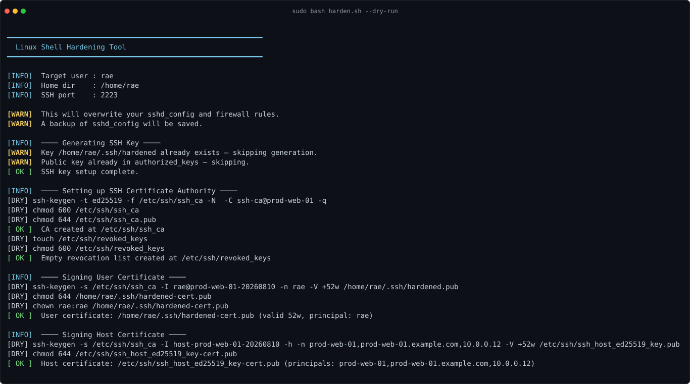
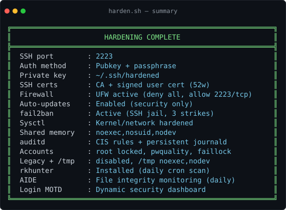
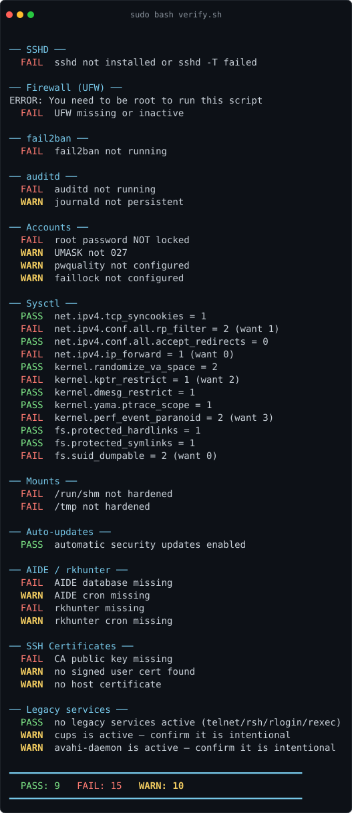
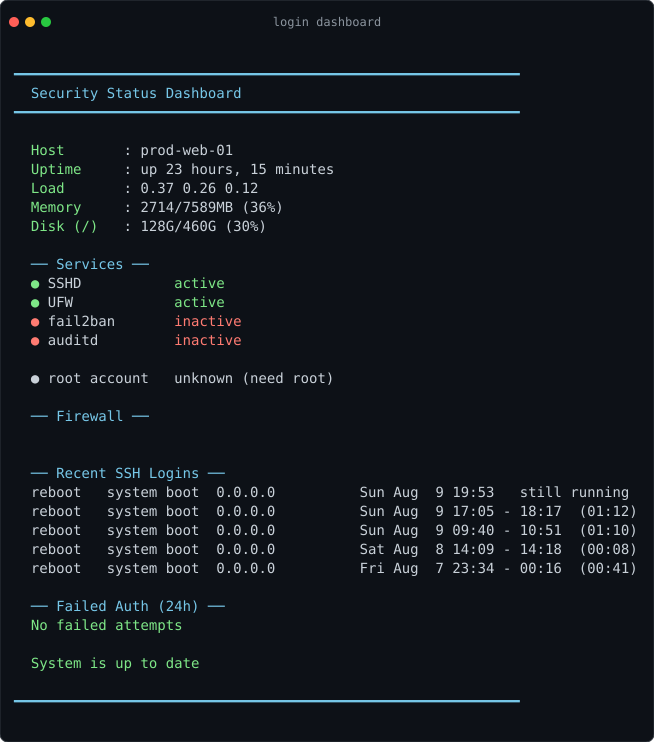

# SSH Hardening & Key Management Toolkit

The baseline every new Linux VM gets: hardened sshd with CA-signed certificates, locked-down firewall, auditd, account policies, kernel sysctls, and a compliance self-audit — all in one run. Four scripts, two workflows. Pick what you need.

## The scripts

| Script | What it's for |
|--------|---------------|
| `generate.sh` | Generate a passphrase-protected Ed25519 key pair on your local machine |
| `deploy.sh` | Push your key to remote servers — optionally replace old keys, optionally harden |
| `harden.sh` | Full lockdown — sshd + certs, firewall, auto-updates, fail2ban, sysctl, auditd, accounts, mounts |
| `verify.sh` | Read-only compliance self-audit — PASS/FAIL/WARN on every control, exits non-zero on failure |

`lib/` holds the modules sourced by `harden.sh` — not run directly.

## Screenshots

**One run, full baseline** — `sudo bash harden.sh` (shown with `--dry-run`):





**Compliance self-audit** — `sudo bash verify.sh` (this is an unhardened box, so it's mostly red — after `harden.sh` it's green):



**Login dashboard** — shown on every SSH login:



## Quick start

```bash
chmod +x harden.sh deploy.sh generate.sh verify.sh
```

---

## Workflow 1 — Just rotate / replace SSH keys

Already have a hardened server (or any server) and just want to swap out the SSH keys? No sshd changes, no firewall changes — just key management.

**Step 1: Generate a new key locally**

```bash
bash generate.sh              # creates ~/.ssh/hardened
bash generate.sh mykey        # creates ~/.ssh/mykey (custom name)
```

**Step 2: Push it to your server**

```bash
# Append your new key (keeps existing keys)
bash deploy.sh user@server-ip

# Or wipe all old keys and replace with yours only
bash deploy.sh user@server-ip 2223 --replace
```

That's it. Old keys gone, new key in place, nothing else touched.

```bash
ssh -p 2223 -i ~/.ssh/hardened user@server-ip
```

---

## Workflow 2 — Full hardening (fresh system)

Got a fresh VPS or a box that still has password auth wide open? This locks down everything in one shot: SSH config, certificates, firewall, auditd, account policies, the works.

### Option A: Run directly on the server

```bash
sudo bash harden.sh                    # hardens for the current sudo user
sudo bash harden.sh --user someuser    # hardens for a specific user
sudo bash harden.sh someuser           # same thing (positional, back-compat)
```

### harden.sh flags

| Flag | What it does |
|------|--------------|
| `--user name` | Target user for keys/certs (default: `$SUDO_USER`); `--user=name` also works |
| `--dry-run` | Print what would change without changing anything |
| `--cert-only` | Disable `authorized_keys` auth entirely — only CA-signed certs log in |
| `-h`, `--help` | Usage summary |

The script will:

1. Install `openssh-server` if missing
2. Generate a passphrase-protected Ed25519 key pair (`~/.ssh/hardened`)
3. Add the public key to `authorized_keys`
4. Create an SSH CA (`/etc/ssh/ssh_ca`) and sign a user cert (valid 52 weeks) + host cert
5. Write a hardened `sshd_config` (pubkey-only, port 2223, root disabled, modern ciphers, CA trust)
6. Install UFW and lock the firewall down to port 2223 only
7. Enable automatic security updates (unattended-upgrades / dnf-automatic / yum-cron)
8. Install and configure fail2ban (bans IPs after 3 failed SSH attempts for 24h)
9. Apply kernel/network hardening via sysctl (SYN cookies, anti-spoofing, ASLR, ptrace/dmesg restrictions)
10. Harden shared memory (`/run/shm` mounted with `noexec,nosuid,nodev`)
11. Install auditd with CIS-style rules + persistent journald
12. Harden accounts (root locked, pwquality, faillock, umask 027, su restricted, core dumps off)
13. Disable legacy services (telnet/rsh/rlogin/rexec) and mount `/tmp` as `noexec` tmpfs
14. Install rkhunter + AIDE with daily cron jobs and baseline snapshots
15. Set up a dynamic MOTD security dashboard (shown on every SSH login)
16. Print a one-liner to copy your private key + cert to your local machine
17. Run `verify.sh` as a final self-audit

> ⚠️ **Do NOT close your SSH session** until you verify access from a second terminal.

### Option B: Harden remotely via deploy.sh

If you already have `~/.ssh/hardened` on your local machine (from `generate.sh` or a previous run), you can harden a remote server without logging into it manually:

```bash
# Push your key + full hardening
bash deploy.sh user@server-ip 22 --harden

# Replace old keys + full hardening
bash deploy.sh user@server-ip 22 --replace --harden
```

With `--harden`, deploy.sh also pulls the signed user cert back to `~/.ssh/hardened-cert.pub` and offers to pin the host CA in your `~/.ssh/known_hosts` (see [SSH certificates](#ssh-certificates)).

After either option:

```bash
ssh -p 2223 -i ~/.ssh/hardened user@server-ip
```

### deploy.sh flags

| Flag | What it does |
|------|--------------|
| *(none)* | Appends your key to `authorized_keys` — existing keys stay |
| `--replace` | Wipes `authorized_keys` and adds only your key |
| `--harden` | Copies `harden.sh` to the server and runs it (full lockdown), then pulls the signed cert + pins the host CA |

Flags combine: `--replace --harden` wipes old keys *and* hardens the server.

```bash
bash deploy.sh user@server-ip [port] [--replace] [--harden]
```

---

## What gets locked down (with --harden / harden.sh)

| Setting | Value |
|---------|-------|
| SSH Port | `2223` |
| Authentication | Pubkey only (password login disabled) |
| Key type | Ed25519 + passphrase |
| SSH certificates | Server-local CA at `/etc/ssh/ssh_ca`; user cert `~/.ssh/hardened-cert.pub` valid 52 weeks; host cert; revocation via `/etc/ssh/revoked_keys` |
| Root login | Disabled (SSH) + root password locked (console/su) |
| Max auth tries | 3 |
| X11 / TCP / Agent forwarding | Disabled |
| Key exchange | `curve25519-sha256` only |
| Ciphers | `chacha20-poly1305`, `aes256-gcm`, `aes128-gcm` |
| MACs | `hmac-sha2-512-etm`, `hmac-sha2-256-etm` |
| Host key algorithms | `ssh-ed25519-cert-v01@openssh.com` (host certificate) + `ssh-ed25519` |
| Firewall (UFW) | Deny all in/out, allow `2223/tcp` + DNS/HTTP/HTTPS/NTP/DHCP outbound |
| Auto-updates | Security-only (unattended-upgrades / dnf-automatic / yum-cron) |
| fail2ban | SSH jail — 3 failed attempts = 24h ban |
| auditd | CIS-style rules (`/etc/audit/rules.d/hardening.rules`): identity files, sshd config + CA, time changes, kernel modules, sudo/su, setuid/setgid syscalls, logins; journald set to persistent |
| Password quality | pwquality `minlen 14` + digit/upper/lower/other character classes |
| Account lockout | faillock: 5 failed attempts → 15 min lockout |
| umask | `027` via `/etc/login.defs` (+ 90-day password aging) |
| su restriction | `pam_wheel` — only the sudo/wheel group can `su` |
| Core dumps | Disabled (`/etc/security/limits.d/99-hardening.conf`, `fs.suid_dumpable=0`) |
| Sysctl | SYN cookies, anti-spoofing, no ICMP redirects, no source routing |
| Kernel extras | Full ASLR, `kptr_restrict=2`, `dmesg_restrict=1`, `ptrace_scope=1`, `perf_event_paranoid=3` |
| Legacy services | telnet/rsh/rlogin/rexec disabled + masked |
| /tmp | tmpfs mounted `noexec,nodev,nosuid` (`/etc/systemd/system/tmp.mount`) |
| Shared memory | `/run/shm` mounted `noexec,nosuid,nodev` |
| rkhunter | Rootkit scanner with daily cron, baseline snapshot |
| AIDE | File integrity monitor with daily cron, baseline snapshot |
| Login MOTD | Dynamic security dashboard (services, bans, logins, scan results) |

---

## SSH certificates

harden.sh turns the server into its own tiny certificate authority:

- **CA key** lives on the VM at `/etc/ssh/ssh_ca` (mode 600, passphrase-less so re-signing can be automated).
- **User cert**: your `~/.ssh/hardened.pub` is signed into `~/.ssh/hardened-cert.pub`, valid **52 weeks**, principal = your username. sshd trusts it via `TrustedUserCAKeys /etc/ssh/ssh_ca.pub`.
- **Host cert**: `/etc/ssh/ssh_host_ed25519_key-cert.pub` — lets clients verify the server by CA instead of trusting-on-first-use.
- **Revocation list**: `/etc/ssh/revoked_keys` (wired into sshd as `RevokedKeys`).

### Getting the cert onto your local machine

`deploy.sh --harden` does this for you. Manually:

```bash
# 1. Copy the signed user cert next to your private key
scp -P 2223 user@server-ip:~/.ssh/hardened-cert.pub ~/.ssh/

# 2. Pin the host CA in known_hosts (kills host-key prompts + MITM)
echo '@cert-authority * ssh-ed25519 AAAA... ssh-ca@server' >> ~/.ssh/known_hosts
#    (replace the key blob with the actual contents of /etc/ssh/ssh_ca.pub on the server)

# 3. Connect (ssh picks up hardened-cert.pub automatically)
ssh -p 2223 -i ~/.ssh/hardened user@server-ip
```

Note: deploy.sh pins the CA for that specific host (`@cert-authority server-ip ...`); the manual form above uses `*` to trust the CA for all hosts.

### Revoking a compromised key

Append the public key (one per line) to the revocation list:

```bash
cat ~/.ssh/hardened.pub | sudo tee -a /etc/ssh/revoked_keys
sudo systemctl restart ssh    # or sshd, depending on distro
```

Advanced: KRL mode also works — `sudo ssh-keygen -k -f /etc/ssh/revoked_keys -u /etc/ssh/ssh_ca.pub ~/.ssh/hardened.pub` — but plain append is simpler and one key per line is greppable.

To re-issue after revocation: re-run `sudo bash harden.sh --user <name>` on the server (it signs a fresh cert; existing keys are reused).

### Cert-only mode

`sudo bash harden.sh --cert-only` points `AuthorizedKeysFile` at a nonexistent path, so raw `authorized_keys` entries stop working — only CA-signed certs authenticate. Use it for strict environments where you want every login traceable to a signed cert with an expiry.

---

## verify.sh — compliance self-audit

Read-only audit of every control harden.sh sets. Run it any time:

```bash
sudo bash verify.sh
```

Sample output:

```
── SSHD ──
  PASS  port 2223
  PASS  PermitRootLogin no
  PASS  PasswordAuthentication no
  ...
── SSH Certificates ──
  PASS  sshd trusts /etc/ssh/ssh_ca.pub
  PASS  user cert valid until 2027-08-09 (/home/rae/.ssh/hardened-cert.pub)

━━━━━━━━━━━━━━━━━━━━━━━━━━━━━━━━━━━━━━━━━━━━━━━━━━━━
  PASS: 34   FAIL: 0   WARN: 2
━━━━━━━━━━━━━━━━━━━━━━━━━━━━━━━━━━━━━━━━━━━━━━━━━━━━
```
(counts vary by distro)

Exit codes: `0` = no failures (WARNs allowed), `1` = at least one FAIL. That makes it cron-friendly — example drift alert:

```bash
# /etc/cron.d/newshell-verify (example — adjust path and address; copy the whole
# newshell directory to /opt/newshell — verify.sh sources lib/common.sh)
0 6 * * * root /opt/newshell/verify.sh || mail -s "hardening drift" admin@example.com
```

harden.sh runs verify.sh automatically at the end of every run.

---

## Requirements

- Debian/Ubuntu, Fedora/RHEL, or Arch-based Linux
- Root (sudo) access for hardening
- `openssh-server` (auto-installed by harden.sh if missing)
- systemd (for legacy-service disabling and `/tmp` tmpfs — skipped with a warning otherwise)

faillock/pwquality features degrade gracefully per distro: if `faillock.conf`/`pwquality.conf` or the PAM wiring isn't present, harden.sh warns and moves on instead of failing.

---

## Rollback

harden.sh saves a timestamped backup of your original `sshd_config`:

```
/etc/ssh/sshd_config.bak.YYYYMMDDHHMMSS
```

To revert SSH config:

```bash
sudo cp /etc/ssh/sshd_config.bak.* /etc/ssh/sshd_config
sudo systemctl restart sshd
```

To revert certificate trust only (keep the rest of the hardened config): remove the `TrustedUserCAKeys`, `HostCertificate`, and `RevokedKeys` lines from `/etc/ssh/sshd_config`, then restart ssh.

To revert firewall:

```bash
sudo ufw reset
sudo ufw default allow incoming
sudo ufw enable
```

To revert sysctl hardening:

```bash
sudo rm /etc/sysctl.d/99-hardening.conf
sudo sysctl --system
```

To revert auditd:

```bash
sudo rm /etc/audit/rules.d/hardening.rules && sudo augenrules --load
```

To revert account hardening:

```bash
sudo passwd -u root                                   # re-unlock root
sudo rm /etc/security/limits.d/99-hardening.conf      # re-enable core dumps
# pwquality/faillock: edit values back in /etc/security/pwquality.conf, /etc/security/faillock.conf
# umask/aging: edit /etc/login.defs; pam_wheel: remove the pam_wheel.so line from /etc/pam.d/su
```

To revert /tmp hardening:

```bash
sudo systemctl disable --now tmp.mount && sudo rm /etc/systemd/system/tmp.mount
```

To revert shared memory:

```bash
# Remove the tmpfs line added by harden.sh from /etc/fstab
sudo nano /etc/fstab
```

---

## Security notes / threat model

- **The CA lives on the server it signs for.** Simple and self-contained, but if the box is fully compromised, the attacker can sign certs. Treat CA compromise = box compromise: revoke, rebuild, re-issue certs from a fresh CA.
- **`--cert-only` is the strict mode.** It removes the `authorized_keys` fallback so every login requires a CA-signed, expiring cert — better audit trail, but you must re-sign before certs expire (52 weeks).
- **`authorized_keys` is a deliberate fallback in the default mode.** Your raw pubkey still works alongside the cert, so an expired or lost cert can't lock you out.
- **verify.sh checks configuration, not compromise.** A green run means the controls are still in place; it does not prove the box is clean. That's what AIDE/rkhunter/auditd logs are for.
- **The private key leaves the server once** — via the base64 one-liner in the summary, which passes through your terminal/scrollback. Future improvement: generate the key client-side (`generate.sh`) and push only the pubkey, eliminating the export entirely.
- **This is a baseline, not a substitute** for patching, monitoring, and least-privilege hygiene. Automate verify.sh, watch the audit logs, and keep the system updated.
